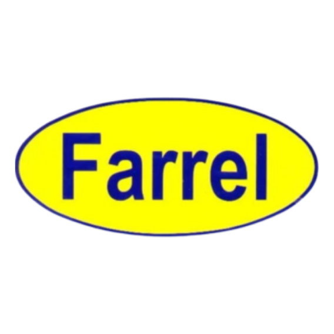

# Panduan Maintenance Website MKVi

Dokumen ini berisi langkah-langkah praktis untuk update website MKVi sendiri — tanpa perlu tahu coding lebih dalam.

**Repo:** `mkvi-id.github.io`
**Live URL:** https://mkvi-id.github.io/
**File utama:** `index.html`

---

## Daftar Isi

1. [Persiapan Sebelum Edit](#1-persiapan-sebelum-edit)
2. [Update File PDF (PriceList, Detail Layanan, Proposal)](#2-update-file-pdf)
3. [Mengganti Logo Klien](#3-mengganti-logo-klien)
4. [Mengganti Gambar Hero](#4-mengganti-gambar-hero)
5. [Update Service Card](#5-update-service-card)
6. [Menambah / Menghapus Section](#6-menambah--menghapus-section)
7. [Update Navigation Menu](#7-update-navigation-menu)
8. [Update Nomor WhatsApp & Email](#8-update-nomor-whatsapp--email)
9. [Update Statistik Hero (jumlah proyek/klien)](#9-update-statistik-hero)
10. [Deploy Perubahan ke Live Website](#10-deploy-perubahan)
11. [Troubleshooting](#11-troubleshooting)

---

## 1. Persiapan Sebelum Edit

### Tool yang dibutuhkan
- **Text editor:** Visual Studio Code (gratis) — download di [code.visualstudio.com](https://code.visualstudio.com)
- **Browser:** Chrome / Edge / Firefox untuk preview
- **Git:** sudah terinstall di komputer kamu

### Workflow umum (selalu sama)

```
1. Edit file di komputer (D:\Freelance\Website MKVi\)
2. Preview di browser → buka file index.html langsung (double-click)
3. Kalau sudah OK → upload/commit ke GitHub
4. Tunggu 1-2 menit → cek live website
```

### Tips: Live preview di VS Code

Install extension **"Live Server"** di VS Code. Setelah install:
- Klik kanan `index.html` → **"Open with Live Server"**
- Browser auto-refresh setiap kali kamu save file (Ctrl+S)

---

## 2. Update File PDF

### Kapan dilakukan?
Ketika file PDF (PriceList, Detail Layanan, Proposal) sudah final desainnya dan ingin replace versi draft.

### ⚠️ PENTING: Jaga nama file persis sama

Nama file harus sama persis dengan yang sudah ada di repo:
- `PriceList_MKVi_2026.pdf`
- `Detail_Layanan_MKVi_2026.pdf`

Kalau nama file diubah, link download di website akan **broken**.

### Cara 1: Via Web Browser (paling mudah)

1. Buka [github.com/mkvi-id/mkvi-id.github.io](https://github.com/mkvi-id/mkvi-id.github.io)
2. Klik nama file PDF yang mau diganti (misal `PriceList_MKVi_2026.pdf`)
3. Klik ikon **pensil ✏️** di kanan atas → tidak bisa edit PDF, jadi:
4. Klik ikon **trash 🗑️** → commit message: `Replace PriceList with final version` → Commit
5. Balik ke halaman utama repo → klik **"Add file" → "Upload files"**
6. Drag PDF versi baru (dengan nama persis sama)
7. Commit message: `Add new PriceList`
8. Commit changes
9. **Tunggu 1-2 menit** untuk GitHub Pages rebuild

### Cara 2: Via Git Command Line (lebih cepat)

```bash
# Clone repo (sekali saja)
cd D:\Freelance
git clone https://github.com/mkvi-id/mkvi-id.github.io.git mkvi-website-git
cd mkvi-website-git

# Tiap kali update PDF:
# 1. Copy PDF baru ke folder ini (overwrite yang lama)
# 2. Commit & push
git add .
git commit -m "Update PriceList PDF: final design"
git push
```

Website auto-update dalam ~1 menit setelah `git push`.

---

## 3. Mengganti Logo Klien

### Lokasi di file

Section **`<section id="clients">`** — sekitar baris 590-1040 di `index.html`.

Setiap klien punya block seperti ini:

```html
<div class="client-card">
  <div class="client-logo-wrap">
    <!-- REPLACE: swap the .client-placeholder div below with an  tag when logo is ready -->
    <div class="client-placeholder">FA</div>
  </div>
  <div class="client-name">farrel.co.id</div>
</div>
```

### Langkah ganti placeholder dengan logo asli

**Step 1:** Buat folder `logos/` di root repo, upload semua logo klien ke sana. Contoh nama file:
- `logos/farrel.png`
- `logos/gokomodo.png`
- `logos/woo-wa.png`

**Format yang direkomendasikan:**
- PNG transparent (bukan JPG)
- Ukuran ~200x200px atau persegi
- Resolusi minimal 72dpi

**Step 2:** Cari client-card yang mau diganti, edit block tersebut:

```html
<!-- SEBELUM -->
<div class="client-logo-wrap">
  <div class="client-placeholder">FA</div>
</div>

<!-- SESUDAH -->
<div class="client-logo-wrap">
  
</div>
```

### Tambah klien baru

Copy block client-card yang sudah ada, ubah nama & logo:

```html
<div class="client-card">
  <div class="client-logo-wrap">
    
  </div>
  <div class="client-name">klienbaru.com</div>
</div>
```

Paste di dalam `<div class="clients-grid">` yang sesuai (Web / Apps / CP Video / dll).

### Hapus klien

Tinggal hapus seluruh block `<div class="client-card">...</div>` yang tidak diinginkan.

---

## 4. Mengganti Gambar Hero

### Lokasi di file

Section **`<section class="hero" id="home">`** — sekitar baris 425-477.

Gambar hero saat ini berupa **base64 image** yang ter-embed langsung di file. Format:

```html

```

### Langkah ganti hero image

**Cara 1: Pakai file gambar terpisah (recommended)**

1. Upload gambar baru ke folder `assets/` di repo (misal `assets/hero-new.jpg`)
2. Cari kode hero image di `index.html`
3. Ganti `src="data:image/png;base64,..."` jadi `src="assets/hero-new.jpg"`

**Cara 2: Pakai base64 (lebih ribet, tapi 1 file all-in-one)**

1. Konversi gambar ke base64 di [base64.guru](https://base64.guru/converter/encode/image)
2. Copy hasil → ganti string base64 lama di `src="data:image/png;base64,..."`

**Rekomendasi:** Pakai Cara 1. File `index.html` jadi lebih ringan dan mudah di-maintain.

### Spesifikasi gambar hero yang baik
- Rasio: landscape (16:9 atau 4:3)
- Ukuran: 1200x800px atau lebih besar
- Format: JPG (kompres dulu di [tinypng.com](https://tinypng.com))
- Ukuran file: < 300KB

---

## 5. Update Service Card

### Lokasi
Section **`<section id="services">`** — sekitar baris 514-560.

Saat ini ada **6 service card**. Setiap card formatnya:

```html
<div class="service-card">
  <div class="service-icon">🌐</div>
  <h3>Web & App Development</h3>
  <p>Deskripsi layanan...</p>
</div>
```

### Edit deskripsi/icon

Cari `<h3>Nama Layanan</h3>` → langsung edit text di antara tag `<h3>` dan `<p>`.

**Icon emoji** bisa langsung diganti — copy emoji baru dari [emojipedia.org](https://emojipedia.org) → paste di antara `<div class="service-icon">` dan `</div>`.

### Tambah service card baru

Copy 1 block `<div class="service-card">...</div>`, paste di dalam `<div class="services-grid fade-in">`, edit isinya.

**Grid akan auto-adjust** — tidak perlu setting kolom manual.

### Hapus service card

Hapus seluruh block `<div class="service-card">...</div>` yang tidak diinginkan.

---

## 6. Menambah / Menghapus Section

### Struktur dasar section

Setiap section punya pola yang konsisten:

```html
<!-- NAMA SECTION -->
<section id="nama-section">
  <div class="section-header fade-in">
    <div class="section-tag">Tag Kecil</div>
    <h2 class="section-title">Judul Section</h2>
    <p class="section-sub">Subtitle/deskripsi...</p>
  </div>

  <!-- Konten section -->
  <div class="content fade-in">
    ... isi section ...
  </div>
</section>
```

### Tambah section baru

**Step 1:** Cari posisi yang diinginkan (misal antara `#services` dan `#harga`).

**Step 2:** Paste template section di atas, ubah:
- `id="nama-section"` → ID unik (misal `id="testimoni"`)
- Section tag, title, subtitle sesuai konten

**Step 3:** Update navigation — tambah link di nav:

```html
<li><a href="#testimoni">Testimoni</a></li>
```

**Step 4:** Kalau butuh styling khusus, tambah CSS di dalam `<style>` (cari `/* ===== TESTIMONI ===== */` sebagai marker).

### Hapus section

1. Hapus seluruh `<section id="...">...</section>` block
2. Hapus link nav yang merujuk ke section itu (`<li><a href="#...">...</a></li>`)
3. (Opsional) Hapus CSS yang khusus untuk section itu

---

## 7. Update Navigation Menu

### Lokasi
Section **`<nav id="main-nav">`** — sekitar baris 408-422.

```html
<ul class="nav-links" id="nav-links">
  <li><a href="#about">Tentang</a></li>
  <li><a href="#services">Layanan</a></li>
  <li><a href="#harga">Harga</a></li>
  <li><a href="#clients">Klien</a></li>
  <li><a href="#proposal">Proposal</a></li>
  <li><a href="#contact">Kontak</a></li>
</ul>
```

### Tambah link nav

Tambah `<li>` baru:
```html
<li><a href="#testimoni">Testimoni</a></li>
```

**⚠️ Pastikan ID section harus persis match** dengan `href`-nya. Kalau section ID-nya `id="testimoni"`, nav-nya `href="#testimoni"`.

### Hapus link nav

Hapus seluruh baris `<li><a href="#...">...</a></li>` yang tidak diinginkan.

### Ubah urutan

Copy-paste posisi `<li>` ke urutan yang diinginkan.

---

## 8. Update Nomor WhatsApp & Email

### Update Nomor WhatsApp

Nomor WhatsApp saat ini: `+62 822-5745-9705`. Dipakai di **6 tempat** di `index.html`:

1. Nav CTA button (atas)
2. Contact section button
3. Floating WhatsApp button
4. Form Harga: redirect setelah submit (`_next`)
5. Form Proposal: redirect setelah submit (`_next`)
6. Footer

**Cara cepat:** Pakai **Find & Replace** di VS Code (`Ctrl+H`):

- Find: `6282257459705`
- Replace: `62XXXXXXXXXXX` *(nomor baru tanpa + dan tanpa spasi)*
- Klik **"Replace All"**

Jangan lupa juga update di file:
- `thanks-pricelist.html`
- `thanks-proposal.html`

### Update Email Form

Email saat ini: `myerkvi@gmail.com`. Dipakai di **2 tempat** (kedua form).

**Cara cepat:**
- Find: `formsubmit.co/myerkvi@gmail.com`
- Replace: `formsubmit.co/email-baru@example.com`
- Replace All

**⚠️ Setelah ganti email:** wajib **submit ulang form sekali** untuk dapat email aktivasi FormSubmit ke email baru, lalu klik link aktivasi.

---

## 9. Update Statistik Hero

### Lokasi
Section hero, sekitar baris 440-450:

```html
<div class="hero-stats">
  <div class="stat">
    <div class="stat-num">20+</div>
    <div class="stat-label">Proyek Selesai</div>
  </div>
  <div class="stat">
    <div class="stat-num">15+</div>
    <div class="stat-label">Klien Aktif</div>
  </div>
  <div class="stat">
    <div class="stat-num">3+</div>
    <div class="stat-label">Tahun Berkarya</div>
  </div>
</div>
```

**Update angka:** langsung edit text di antara `<div class="stat-num">...</div>`.

**⚠️ JUJUR dengan angka.** Klien corporate bisa verify. Lebih baik tulis "15+" yang asli daripada "100+" yang exaggerate.

---

## 10. Deploy Perubahan

### Cara 1: Via Web Browser (untuk update kecil)

1. Buka file yang mau diedit di github.com/mkvi-id/mkvi-id.github.io
2. Klik ikon **pensil ✏️** di kanan atas
3. Edit langsung di browser
4. Scroll ke bawah → Commit message → klik **"Commit changes"**
5. **Tunggu 1-2 menit** → cek live di [mkvi-id.github.io](https://mkvi-id.github.io)

### Cara 2: Via Git Command Line (untuk update banyak file)

```bash
# Sekali saja: clone repo ke komputer (kalau belum)
git clone https://github.com/mkvi-id/mkvi-id.github.io.git
cd mkvi-id.github.io

# Tiap kali update:
# 1. Edit file di text editor
# 2. Commit & push:
git add .
git commit -m "Update: [jelaskan apa yang berubah]"
git push
```

### Hard refresh browser

Setelah deploy, kalau perubahan tidak terlihat:
- **Chrome/Edge:** `Ctrl + Shift + R` (Windows) atau `Cmd + Shift + R` (Mac)
- **Firefox:** `Ctrl + F5`

Ini force browser load versi terbaru, bukan dari cache.

---

## 11. Troubleshooting

### "Live website tidak update setelah commit"

**Penyebab:**
1. GitHub Pages butuh waktu rebuild (1-3 menit) → tunggu
2. Browser cache → hard refresh (`Ctrl+Shift+R`)
3. Check status di **Settings → Pages** → ada error message?

**Cek status build:** Buka repo → tab **"Actions"** → lihat workflow terakhir, apakah berhasil (✓ hijau) atau gagal (✗ merah).

### "PDF download tidak jalan, error 404"

**Penyebab:** Nama file PDF di link tidak match dengan nama file di repo.

**Cek di `index.html`:**
```html
<a href="PriceList_MKVi_2026.pdf">
```

Pastikan `PriceList_MKVi_2026.pdf` ada di root repo dengan nama **persis sama** (case-sensitive: `PriceList` bukan `pricelist`).

### "Form submit tapi tidak ada email"

**Checklist:**
1. Cek folder Spam di email
2. Cek apakah FormSubmit sudah diaktivasi (klik link aktivasi yang dikirim ke email saat submit pertama)
3. Cek email di `index.html` benar (`formsubmit.co/your-email@example.com`)
4. Test dari incognito browser

### "Style website berantakan / aneh"

**Penyebab umum:** HTML tag tidak balance (ada `<div>` yang tidak punya `</div>`).

**Cara debug:**
1. Buka VS Code → file `index.html`
2. Tekan `Ctrl+Shift+P` → search "Format Document"
3. Kalau ada tag yang error, VS Code akan tunjukkan di kiri (garis merah)

**Atau pakai online validator:**
- Copy isi `index.html` → paste ke [validator.w3.org/nu](https://validator.w3.org/nu) → klik validate

### "Section baru tidak muncul di nav"

**Cek 2 hal:**
1. ID section di `<section id="xxx">` harus persis match dengan `href="#xxx"` di nav
2. Section tidak boleh di-comment-out (`<!-- ... -->`)

### "Logo klien terlihat distorted/blur"

**Penyebab:** ukuran asli logo terlalu kecil (< 80px) atau bukan square ratio.

**Solusi:**
1. Edit logo di Photoshop/Figma → resize jadi minimum 200x200px
2. Atau tambah inline style:
```html

```

---

## Tips Bonus

### Backup sebelum edit besar

Sebelum update besar (misal restructure section), **download backup** dari GitHub:
1. Buka repo → klik tombol hijau **"Code" → "Download ZIP"**
2. Simpan ZIP di folder lokal dengan tanggal (misal `backup-2026-06-17.zip`)
3. Kalau ada masalah, bisa restore manual

### Cek live preview sebelum commit

Sebelum commit ke GitHub:
1. Buka file `index.html` di browser langsung (double-click)
2. Cek semua section tampil dengan benar
3. Cek di mobile view → buka DevTools (`F12`) → klik ikon device → pilih iPhone/Android
4. Baru commit kalau sudah OK

### Versi backup di repo

Sebelum edit besar, copy `index.html` jadi `index-backup-YYYYMMDD.html` di folder yang sama. Kalau ada error, bisa balikkan.

---

## Kontak Bantuan

Kalau ada masalah teknis yang tidak bisa diselesaikan sendiri:
- **Abim** (IT Engineer) — untuk masalah HTML/CSS/Git
- **Tim MKVi internal Slack/WhatsApp** — diskusi tim

Atau buka **issue di GitHub repo** untuk dokumentasi internal.

---

**Last updated:** Juni 2026
**Maintained by:** Tim MKVi
